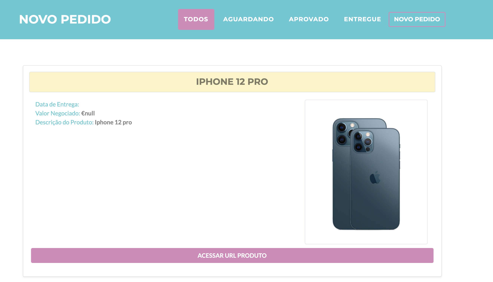

#  
# Aplicativo de Venda de Produtos

For this Aplication was used the folllowing tecnologies:

* [Spring Boot Framework](https://spring.io)
* [Apache Maven](https://maven.apache.org)
* [Thymeleaf](https://www.thymeleaf.org/)
* [Postgre Database](https://www.postgresql.org/docs/)
* [Heroku for Deployment](https://www.heroku.com)

For the Frontend was used the following tecnologies:
* [HTML5](https://www.w3schools.com/html/)
* [CSS Bootstrap](https://getbootstrap.com/docs/5.0/getting-started/introduction/)
* [JavaScript](https://devdocs.io/javascript/)
* [JQuery](https://api.jquery.com/)

The 1.0 Version the Aplication can do the requisitions:

Heroku Host: https://app-mundi.herokuapp.com/home

